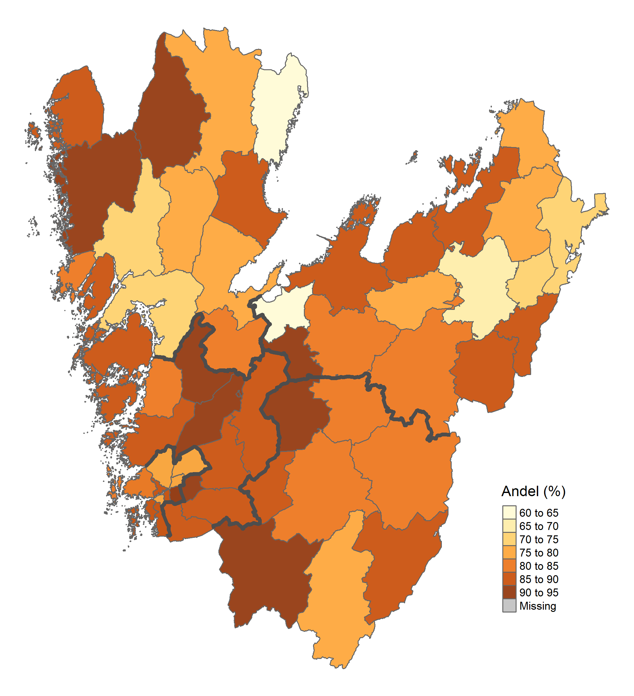

```{r setup, include=FALSE}
knitr::opts_chunk$set(echo = FALSE)
```


## Barns kognitiva utveckling

Det är under de första levnadsåren som förutsättningar skapas för lärande, när det centrala nervsystemet utvecklas. Hastigheten med vilket hjärnan utvecklas är närmast ofattbart hög under de första levnadsåren för att därefter minska väsentligt redan under tonåren.  Det finns därför ett kritiskt tidsfönster under de första levnadsåren när nyttan av insatser för att stödja barnets utveckling är särskilt hög.  Detta är en viktig poäng eftersom hastigheten med vilken detta sker går att påverka genom att barnets sinnen stimuleras. Genom att få kontakt med barnet, prata, sjunga och läsa för det stimuleras barnets sinnesorgan till att bilda kopplingar mellan olika centra i hjärnan med större hastighet än vad som annars skulle vara fallet. På så sätt grundläggs barnets kognitiva förmåga och därmed förmågan att hantera allt större mängder information vilket blir avgörande för barnets förmåga att lära sig saker under skoltiden. Och omvänt, ett barn som inte får tillräckliga stimuli utvecklar sina kopplingar långsammare och får sämre förutsättningar till en god kognitiv förmåga. 

### Livsvillkoren spelar roll för kognitiv förmåga

Barnets livsvillkor har stor betydelse för hur den kognitiva förmågan utvecklas (Hackman och Farah, 2009). Forskningen ger idag starkt stöd för att t.ex. familjens ekonomiska villkor i tidig barndom har stor betydelse för barnets skolgång (Lake och Chan, 2015; Shonkoff, 2012). Senare års neurobiologisk forskning har undersökt hur familjens sociala situation påverkar hjärnans utveckling och visar hur erfarenheter som barn har tidigt i livet spelar en viktig roll i utvecklingen av hjärnans arkitektur (National Scientific Council on the Developing Child, 2007). Forskningen har särskilt intresserat sig för hur interaktionen mellan den genetiska uppsättningen och barnets erfarenheter formar hjärnans utveckling. Även om genetiken ger en ”blåkopia” för hur utvecklingen av kopplingarna mellan olika centra formas, förstärks dessa kopplingar genom ”upprepad användning” – när barnet babblar, jollrar, gestikulerar och föräldern eller någon annan person besvarar genom t.ex. ögonkontakt, ord eller omfamning, byggs neurala kontakter upp och förstärks – en serve and return-process. När vuxna i barnets omgivning uppmärksammar och besvarar barnets olika uttryck och behov förser de barnet med en omgivning rik på serve and return.

Om vuxnas svar på barnets uttryck är opålitligt, inadekvat eller t.o.m. helt saknas kan uppbyggnaden av hjärnans arkitektur störas vilket kan påverka barnets kognitiva utveckling. En långvarigt bristande serve and return innebär ett dubbelt hot mot hjärnans utveckling: utöver att hjärnan inte får den stimulering den behöver kommer kroppens stressreaktion att aktiveras vilket bl.a. leder till att den växande hjärnan översköljs med potentiellt skadliga stresshormoner. 

**Bild på stressorer - stress - hjärnans utveckling in här**

Störningar i serve and return interaktioner kan ha många orsaker. Det är uppenbart då föräldrarna saknar förmåga att ha hand om barnet som en följd av t.ex. drogmissbruk eller gravt psykotiska tillstånd men också den form av kronisk stress som kan uppstå som en följd av långvariga ekonomiska problem, social isolering eller kronisk sjukdom kan leda till att vårdnadshavare helt enkelt inte har energi över för att i tillräcklig grad tillgodose barnets behov av stimulans – de dagliga bekymren dränerar den vuxne på energi. Sådana mekanismer kan vara en viktig del av förklaringen till att socioekonomiska skillnader i barns utveckling och hälsa uppstår.

Detta är den biologiska bakgrunden till att tidiga insatser blir så viktiga – under de första levnadsåren finns ett tillfälle för att lägga grunden till barnets kognitiva förmåga, som inte återkommer senare i livet.

### Samhälleliga resurser kan kompensera

Föräldrarnas sociala, ekonomiska och ”pedagogiska” resurser spelar därmed stor roll för hur barnets hjärna utvecklas. När inte dessa är tillräckliga blir det viktigt att det finns andra samhälleliga resurser som kan kompensera barnets behov. Det är de samlade insatserna från föräldrar, familj, lokalsamhälle och välfärdsinstitutionerna som under denna period har livslånga positiva effekter på barnets hälsa, välbefinnande, inlärningsförmåga vilket senare har stor betydelse för förmågan att kunna försörja sig och etablera ett självständigt liv.

### Kognitiv förmåga bland barn i Västra Götaland
Det finns inte några systematiskt insamlade data av hur kognitiv förmåga bland små barn fördelar sig i förhållande till familjens livsvillkor eller i olika geografiska områden. Det närmaste vi idag kommer är information från BHV beträffande utfallet av språktest vid 2½-årsbesöket vid BVC. 

```{r fig1, echo=FALSE, out.width="60%%", fig.cap="***Figur 1** Andelen barn utan anmärkning på språktest vid 2½-årsbesöket på BVC år 2019. Källa: BHV, Västra Götalandsregionen.*"}

```

Språkutvecklingen är en aspekt av flera på kognitiv förmåga hos barnet. Det är därför ett grovt mått som möjligen kan ge en indikation på hur stor andel av barnen som kan ha bristande kognitiv utveckling. Andel barn med anmärkning vid språktest vid 2½ årsbesöket vid BVC varierade mellan 7 och 37 procent bland kommunerna år 2019. Se figur 1. 

### Vad kan man göra?

De insatser som görs tidigt har ofta sikte på att stödja föräldrarnas förmåga att ge barnet optimalt stöd. Exempel på sådana riktigt tidiga insatser är utökade hembesök från BVC, ofta i samverkan med kommunens socialtjänst, samt olika former av föräldrastödsprogram. Av särskild betydelse är förskolans pedagogiska uppdrag. I en kunskapsöversikt sammanfattar Folkhälsomyndigheten att analyser av naturliga experiment talar för att barn som gått i förskola är bättre på språk och matematik samt rapporterar bättre psykisk hälsa och har färre infektioner. Man noterar också beträffande förskolans organisering och utformning att en högre andel utbildade förskollärare bland personalen kan förbättra barnens utveckling liksom möjligheten till kompetensutveckling och fortbildning, etablerade rutiner för hur övergången från förskola till skola ska gå till samt om personaltätheten är hög. Det är dock oklart på vilket sätt en ökad personaltäthet påverkar barns hälsa och kognitiva utveckling då det vetenskapliga underlaget är otillräckligt (Folkhälsomyndigheten och Centrum för epidemiologi och samhällsmedicin (CES), 2017). 

De biologiskt grundade argumenten för tidiga insatser är i linje med ekonomisk forskning som studerat return of investment vid satsningar i olika åldrar. Resultaten talar för att man inte bara får mer för varje satsad krona ju tidigare man satsar utan även att investeringen är mer kostnadseffektiv ju tidigare man satsar (Shonkoff et al., 2009).


```{r echo=FALSE, message=FALSE, fig.align='center'}

# library(readxl)  
# library(tidyverse)
# library(highcharter)
#   
# df <- read_excel("data/gymbeh_2020.xlsx")
# 
# hchart(df, "line", 
#        hcaes(x = year, y = p_beh, group = KF),
#        width = 200)

```


