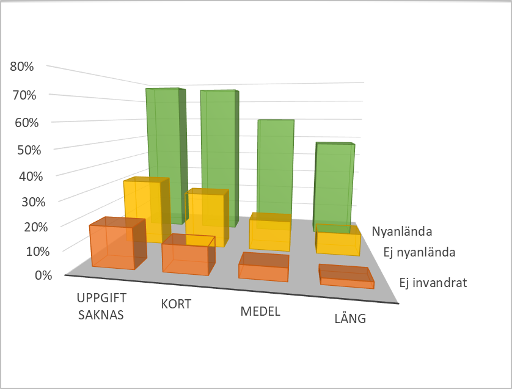
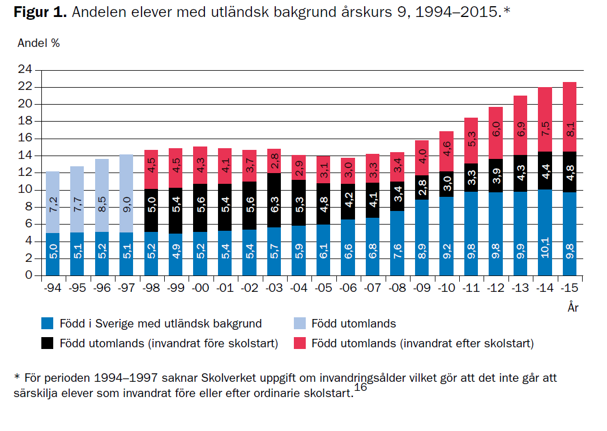
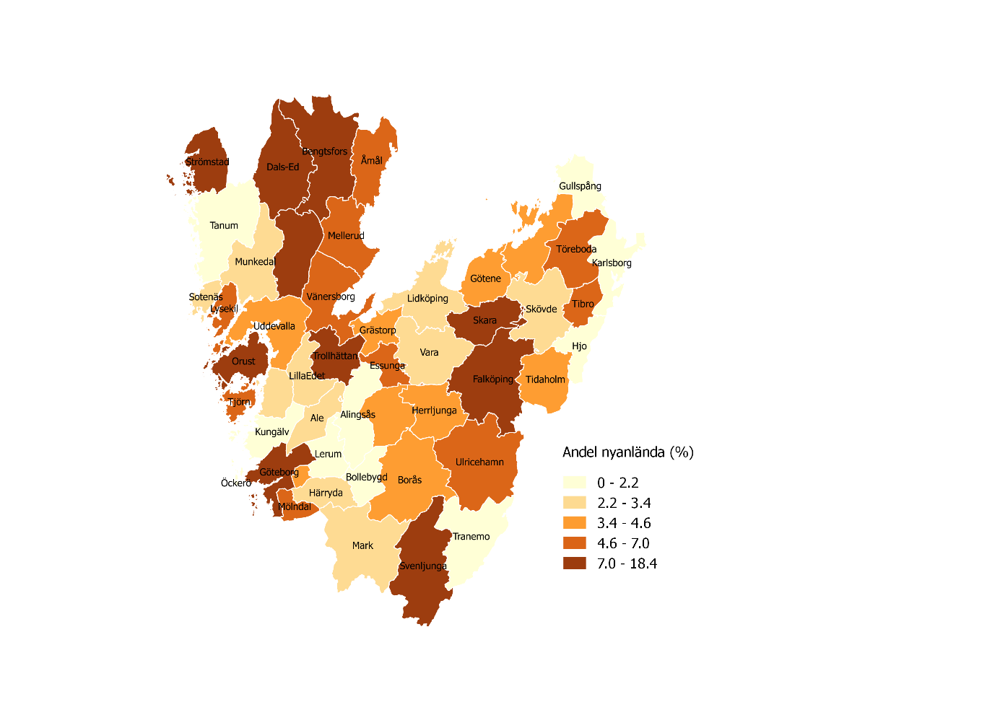
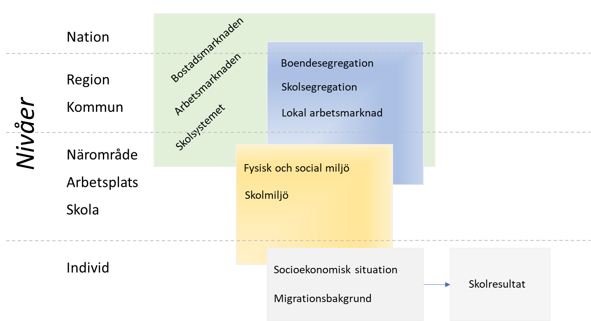
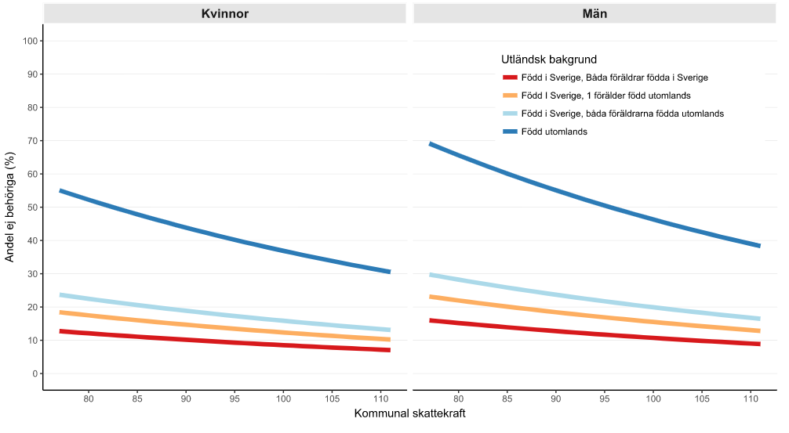

```{r setup_schoolage, include=FALSE}
knitr::opts_chunk$set(echo = TRUE)
```

## Vad beror skolmisslyckanden på?

Variationen i skolresultat är stor i Västra Götaland. På skolnivå varierar t.ex. andelen behöriga avgångselever i åk 9 mellan 30 och 100 procent (2017). Denna variation har ökat påtagligt sedan 1990-talets början (Böhlmark and Holmlund, 2011; Gustafsson and Hansen, 2017).

** Figur på variationen i skolresultat i VG in här.**

De ökade skillnaderna i skolresultat kan till stor del förklaras av en förändrad elevsammansättning där skolorna tenderar att röra sig mot en större homogenitet beträffande elevernas socioekonomiska bakgrund och migrationsbakgrund (Holmlund et al., 2014). Den förändrade elevsammansättningen kan härledas till en ökande boendesegregation och till viss del också på friskolevalet vilket förefaller ha förstärkt effekten av boendesegregation (Grönqvist och Niknami, 2017). Mekanismerna bakom de ökande skillnaderna i elevers skolresultat måste därför sökas i både individuella förutsättningar för lärande och mer strukturella förhållanden vilka påverkar skolornas förmåga att lära ut men också barnens förmåga att lära in. Denna komplexitet försvårar varje försök att analysera drivkrafterna bakom de ökande skillnaderna i skolresultat.  

Sambanden mellan elevens socioekonomiska bakgrund och skolresultat eller mellan migrationsbakgrund och skolresultat är otvetydiga. Elevens sociala bakgrund (vanligen avseende föräldrarnas utbildningsnivå eller inkomst) och elevens migrationsbakgrund är de två enskilda faktorer som anses ha högst förklaringsvärde för elevens skolresultat. Men man får då inte glömma att elevens sociala bakgrund eller migrationsbakgrund får betydelse först då hen möter en social kontext – de individuella egenskaperna interagerar med kontextuella förhållanden. 

### Migrationsbakgrund 

Migrationsbakgrund är ett begrepp som kan beteckna olika saker. I statistiken används begreppet ofta på två sätt:  

- för att markera tiden man vistats i Sverige: om man har anlänt till Sverige nyligen eller om man invandrat till Sverige men gjort det för mer eller mindre längesen;  

- enligt det sätt på vilket SCB definierar utländsk bakgrund, med utgångspunkt i födelseregion: om eleven själv eller föräldrarna är födda utomlands eller om både elev och hens föräldrar är födda utomlands. 

Elevens migrationsbakgrund har stor betydelse för hens skolresultat, i synnerhet om eleven invandrat efter skolstartsålder (Böhlmark and Holmlund, 2011; Skolverket, 2016a). I Figur 1 redovisas andelen avgångselever åk 9 som inte uppnått gymnasiebehörighet 2015 utifrån tiden man vistats i Sverige grupperat efter föräldrarnas utbildningsnivå. 

```{r fig1, echo=FALSE, out.width="60%%", fig.cap="***Figur 1** Andelen (%) avgångselever i åk 9 som inte uppnått gymnasiebehörighet 2015, fördelat på föräldrars utbildningsnivå och migrationsbakgrund. Källa: Västdatabasen.*"}

```

---- **Uppdatera figuren** ----

I samtliga grupper ses en social gradient där elever vars föräldrar har en hög utbildningsnivå har större chans att uppnå gymnasiebehörighet än elever vars föräldrar har en medellång utbildning vilka i sin tur har en högre chans till gymnasiebehörighet än elever vars föräldrar har en låg utbildning. Migrationsbakgrund förstärker denna gradient genom att nyanlända elever, dvs elever som i detta fall anlänt till Sverige 2011 eller senare, löper betydligt större risk att misslyckas med gymnasiebehörighet än övriga elever.  

Skolverket har sammanställt data från IFAU om hur andelen elever i åk 9 med utländsk bakgrund (dvs migrationsbakgrund enligt alt 2 ovan) har förändrats sedan mitten av 1990-talet och hur denna grupp är sammansatt utifrån vistelsetiden i Sverige (Skolverket, 2016a).  

```{r fig2, echo=FALSE, out.width="80%%", fig.cap="***Figur 2** Andelen elever med utländsk bakgrund årskurs 9, 1994-2015. Källa: Skolverket 2016a.*"}

```

---- **Uppdatera mha Stativ-data för VG** ----

Sedan mitten av 1990-talet har andelen elever med utländsk bakgrund i åk 9 nästan fördubblats. Under perioden 2000 – 2006 sjönk andelen med utländsk bakgrund samtidigt fr.a. beroende av att andelen med utländsk bakgrund och som är födda utomlands minskar. Därefter ökade andelen elever i åk 9 med utländsk bakgrund genom att gruppen som är född i Sverige och gruppen som invandrat efter skolstartsålder ökar, särskilt efter 2008. 


```{r fig3, echo=FALSE, out.width="80%%", fig.cap="***Figur 3** Andel nyanlända elever (anlänt till Sverige 2011 – 2014) bland avgångselever i åk 9 år 2015. Källa: Västdatabasen.*"}

```

---- **Uppdatera mha Stativ-data** ----

Denna ökning återspeglas i Västra Götaland på lite olika sätt. Totalt var 5,0 procent av avgångseleverna från grundskolan 2015 nyanlända elever, dvs de hade anlänt till Sverige 2011 eller senare. Andelen nyanlända elever bland avgångseleverna 2015 varierade mellan 0 och drygt 18 procent i kommunerna (Figur 3). Andelen avgångselever 2015 med utländsk bakgrund enligt SCB:s definition var 22,8 procent. 

### Papperslösa barn

Det är inte svårt att föreställa sig att barn till papperslösa föräldrar är en oerhört utsatt och sårbar grupp. Det saknas mycket kunskap om vad tillvaron för dessa barn innebär för deras hälsotillstånd och deras skolgång. Det är av naturliga skäl svårt att veta något om hur många ”papperslösa barn” som lever i Västra Götaland. De försök att skatta antalet papperslösa indikerar att det sannolikt rör sig om 10 000 – 35 000 personer i Sverige (SOU 2011:48, 2011).  Men det är oklart hur många av dessa som är barn liksom hur många av dessa som lever i Västra Götaland.

Det rör sig om en grupp barn som lever i Sverige utan uppehållstillstånd och som inte är asylsökande. De flesta i gruppen har fått avslag på en asylansökan eller är arbetskraftsinvandrare utan arbetstillstånd. Barnens föräldrar är hänvisad till en försörjning på den svarta arbetsmarknaden i den mån släktingar eller vänner eller ideella organisationer inte förmår ge tillräckligt stöd.

Bostadsmarknaden är i princip stängd för denna grupp som får skaffa bostad på den informella bostadsmarknaden vilket ofta leder till täta flyttningar eller hemlöshet. 

En studie som genomförts i Västra Götaland (Ascher och Wahlström Smith, 2016) baseras på djupintervjuer med papperslösa barn och deras föräldrar visar forskarna att barnens tillvaro präglas av en extrem utsatthet men att barnen utvecklade strategier för att möta sin utsatthet genom handling, dels för att minska effekterna av hot och risker, dels för att minska den psykiska pressen på sig själva och sina närstående. De ekonomiska och materiella livsvillkoren var ofta synnerligen hårda med påtaglig fattigdom vilket oroade barnen djupt. Därtill beskrev barnen en extrem utsatthet genom ett ständigt hot om att bli avslöjade och u6tvisade vilket barnen upplevde som livsfarligt.

Dessa barn har samma rätt till utbildning som andra barn även om de inte omfattas av skolplikt . Detta innebär en möjlighet för barnen att få ett rum av ”normalitet”, att åtminstone delar av vardagen få uppleva sammanhang som mer eller mindre liknade vardagen hos andra barn istället för den mer eller mindre kaotiska familjesituationen. Samtidigt innebar skolan en risk för avslöjande och barnen utvecklade en konstant beredskap för att kunna möta hotfulla situationer som kunde uppstå mer eller mindre akut. 
En sådan livssituation medför förstås stora svårigheter att följa skolgången och tillgodogöra sig nya kunskaper.


### Socioekonomiska faktorer 

De livsvillkor som eleven växer upp under spelar stor roll för hens skolgång. Betydelsen av elevernas sociala bakgrund bedöms i senare studier ha ökat sedan 1990-talet  (Gustafsson and Hansen, 2017; Skolverket.2018 ).  

----**Figur på socioekonomiska skillnader - skolresultat in här?**----

Här blir det viktigt att understryka att dessa samband är just samband, statistiska samvariationer, och ska inte förväxlas med orsaker [^1].  Istället bör man reda ut vad det är för faktorer och mekanismer som ger upphov till de statistiska samband vi observerar och mäter. Ibland kan man få höra att föräldrar med låg utbildning har ett lägre engagemang i barnens skolgång eller att det bland dessa föräldrar finns ett motstånd mot skolan och studier i största allmänhet och att det skulle förklara de generellt sämre skolresultaten. Det finns emellertid inget vetenskapligt stöd för dessa påståenden (Bunar, 2015).  

Man måste snarare söka förklaringar i faktorer och mekanismer som är mer unika för elever vars sociala position är mindre gynnsam.  

Dessa kan grupperas i faktorer som har med elevens egna resurser och förmågor att göra och sådana som mer handlar om den kontext i vilken eleven befinner sig. Till den förra gruppen kan man sortera in t.ex. barnets hälsa och kognitiva förmåga, föräldrarnas hälsotillstånd, familjens situation, föräldrarnas förmåga att stödja sina barns skolgång, ekonomiska resurser, boendeförhållanden, arbetsliv, socialt stöd och familjens nätverk.  

Till den senare gruppen hör faktorer som har med t.ex. bostadsområdet att göra, trygghet, kamratkretsar, skolans tillgång på resurser för att genomföra undervisningen, skolans förmåga att vara flexibel gentemot elevers olika förutsättningar för lärande, lärarnas engagemang, omsättningen av lärare, skolpersonalens eventuella fördomar om och förväntningar på elever med en sämre socioekonomisk utgångspunkt. 

Det är naturligtvis så att de individbundna och de kontextuella faktorerna interagerar och kan förstärka eller reducera betydelsen av den socioekonomiska bakgrunden.  

### Elevers hälsotillstånd

Det finns ett starkt samband mellan utbildningsnivå och hälsa (Socialstyrelsen och CHESS, 2012). Skolmisslyckanden är en stark prediktor för framtida ohälsa. Men det är också så att barn med ohälsa eller funktionsvariationer har större risk för skolmisslyckanden. Det sambandet är förstås uppenbart när det gäller elever med sjukdomstillstånd och funktionsvariationer som är beroende av behandling och habiliteringsinsatser. Psykisk ohälsa hos barn och ungdomar har ökat i Sverige sedan 1980-talet och utvecklingen har varit större än i de övriga nordiska länderna. Enligt Socialstyrelsens bedömning hade cirka 10 procent av pojkar och unga män år 2016 någon typ av psykisk ohälsa som föranlett kontakt med hälso- och sjukvård. För unga kvinnor var motsvarande siffra 15 procent. De diagnoser som främst ligger bakom ökningen är depressioner, olika ångestsyndrom och neuropsykiatriska funktionshinder (Socialstyrelsen, 2017). 

En viktig och relativt stor grupp utgörs av tidigt debuterande utvecklingsneurologiska problem, inte sällan överlappande varandra. Denna problematik har sammanfattats som ESSENCE-problematik och beräknas omfatta ca 10 procent av alla skolbarn (Gillberg, 2010). 

Men det finns också en grupp elever vars ohälsa är mindre synlig och där skolan riskerar att inte uppmärksamma deras behov av stöd. Det gäller t.ex. barn med vissa former av psykiatriska tillstånd och barn med lättare intellektuell funktionsnedsättning. Här bygger uppgifter om förekomst oftast på självrapporterade data i samband med olika enkätundersökningar. En stor grupp barn är sårbara och upplever psykosociala besvär t.ex. som en följd av stress i skolan, av mobbning eller utsatthet, eventuellt på grund av sviktande hemsituation. 

För många barn försämras hälsotillståndet under skolåren. Det gäller särskilt barn som lever under snävare livsvillkor, t.ex. till följd av fattigdom, trångboddhet eller föräldrars arbetslöshet. Här pekar forskningen på att en ökande individualisering generellt missgynnar dessa barn (G. Gillberg, 2010; Socialstyrelsen, 2009). I skolan har detta tagit sig uttryck i att eleverna har fått ta ett större ansvar för sin egen utbildning vilket sannolikt är positivt för de barn som kan få ett bra stöd från föräldrar eller andra vuxna runt barnet men missgynnar de barn som inte har adekvat stöd från vuxna runt barnet. Andelen 13- och 15-åringar, fr.a. flickor, med självrapporterade psykiska besvär ökar återigen efter en minskning under 2000-talet och varierar nu mellan 20–40 procent av unga. Denna utveckling menar Socialstyrelsen speglar en reell ökning av psykisk ohälsa och kan knappast förklaras med förändrade behandlingsrutiner eller ökad benägenhet bland unga att rapportera psykiska besvär (Socialstyrelsen, 2017).

En särskilt sårbar grupp är asylsökande barn, ensamkommande barn och i synnerhet papperslösa barn som ofta lever under oanständiga förhållanden.


###	Kontextens betydelse är stor

Under de senaste decennierna har samhället genomgått en genomgripande förändring som en följd av globalisering, digitalisering och demografiska förändringar. Samhällsutvecklingen påverkar kommunernas strategier för att planera sin skolverksamhet. Det är därför viktigt att i analyser av skolresultat också väga in faktorer som så att säga är verksamma ovanför den enskilda elevens huvud och som hen inte kan påverka på egen hand, s.k. kontextuella faktorer.

Det är verkligen inte en originell tanke att människor påverkas av den omgivning man lever i. Det stod klart redan för Hippokrates för 2500 år sedan att människors hälsa påverkas av omgivningen man lever i och att sjukdomsmönster skiljer sig åt mellan olika geografiska områden. Forskningen om hur kontextuella faktorer kan påverka individers hälsotillstånd tog fart under 1990-talet då man upplevde att riskfaktorbundna förklaringar inte var tillräckliga för att förstå hur skillnader i ohälsa mellan befolkningsgrupper kunde uppstå. Forskningen fick också ny energi i och med att nya analysmetoder utvecklades i takt med att datorer blev kraftfullare och gjorde det möjligt att behandla alltmer komplexa statistiska modeller och större datamängder. Multinivå-analyser och rumsliga analyser med hjälp av geografiska informationssystem (GIS) är exempel på sådana verktyg som idag kan användas i vanliga persondatorer.

Nedanstående figur är en schematisk bild av hur faktorer på olika samhällsnivåer kan påverka enskilda elevers skolresultat. 

```{r fig_levels, echo=FALSE, out.width="80%%", fig.cap="***Figur 4** Schematisk bild av samhällsnivåer med exempel på kontexter som påverkar skolresultat. Fritt efter Kölegård (2012).*"}

```

Människors sociala kontext är alltså den politiska, kulturella, sociala och ekonomiska omgivning som karakteriserar ett visst samhälle (Diez Roux and Mair, 2010). I det perspektivet kan det alltså vara otillräckligt att enbart fokusera på individbundna faktorer som t.ex. socioekonomiska förhållanden eller migrationsbakgrund på individnivå, för att förstå varför skillnader i skolresultat uppstår. 

Alla individer har ett visst handlingsutrymme vilket används för att påverka sitt liv så att omständigheterna för sig själv och sina närmaste blir så gynnsamma som möjligt. Men storleken på handlingsutrymmet begränsas av de ekonomiska, kulturella och politiska resurser – individuella och kollektiva - som är tillgängliga för individen.  Dessa resurser samvarierar med den sociala positionen vilket ger upphov till de socioekonomiska skillnader man ser beträffande skolresultat (Phelan et al., 2010; Kommissionen för jämlik hälsa, 2016).

En svårighet är att identifiera på vilket sätt kontextuella faktorer ska definieras. I en tidigare VGR-studie används den kommunala skattekraften som en indikator på den samhälleliga kontexten.[^2] 
Mot bakgrund av att andelen nyanlända elever varierar kraftigt mellan kommunerna i Västra Götaland användes också denna andel som en kontextuell variabel.

[^2]: VGR 2018.

Resultatet från studien visade ett starkt samband mellan den kommunala skattekraften och avgångselevernas skolresultat, även då man kontrollerat för socioekonomiska faktorer och utländsk bakgrund.


```{r fig_context, echo=FALSE, out.width="100%%", fig.cap="***Figur 5** *"}

```

I figuren anges den kommunala skattekraften på x-axeln. Värdet anger procentandelen av riksgenomsnittet (= 100). På y-axeln anges andelen avgångselever som inte lyckats uppnå gymnasiebehörighet. För samtliga ungdomsgrupper finns ett samband sådant att elever som bor i kommuner med lägre skattekraft tenderar att i större utsträckning inte når behörighet till gymnasieskolans yrkeslinjer. Det finns också betydande skillnader mellan elev-grupperna där elever födda utomlands löper en betydligt större risk att misslyckas än övriga grupper. Sverige-födda elever med båda föräldrarna födda i Sverige har lägst andelar men även i denna grupp ses en högre risk för misslyckande om hen bor i kommuner med lägre skattekraft.

Resultaten från studien antyder att kontextuella faktorer som näringslivsstruktur, arbetsmarknad, demografiska och socioekonomiska förhållanden har stor betydelse för risken för skolmisslyckanden. Närings- och arbetsmarknadspolitik kan därför spela stor roll för förmågan att motverka skolmisslyckanden. I det sammanhanget blir det ur Västra Götalandsregionens perspektiv särskilt viktigt att fundera över hur de satsningar som görs för att påverka utvecklingen av näringsliv och arbetsmarknad i regionen också kan bidra till att skolmisslyckanden minskar i hela regionen.

Boendesegregation anses vara en viktig drivkraft bakom en ökande skolsegregation vilken i sin tur är den kanske viktigaste strukturella faktorn bakom de ökade skillnaderna i skolresultat (Skolverket, 2018). Boendesegregation innebär en åtskillnad mellan bostadsområden beträffande t.ex. socioekonomiska faktorer eller utifrån etnisk bakgrund. Boendesegregation kan påverka elevers skolresultat på olika sätt. Vissa områden kommer att karakteriseras av större homogenitet av grupper med små ekonomiska, kulturella och politiska resurser och andra områden i vilka befolkningen har större tillgång till sådana resurser. 

Sådana strukturella förhållanden driver på en homogenisering även i bostadsområdets skolor (Bunar, 2015).  I de förra områdena blir kvaliteten och utbudet av välfärdstjänster och förhållanden i den fysiska miljön väsentliga för att kompensera bristen på resurser på hushållsnivå. Bostadsområden med sämre strukturella förhållanden kan också påverka sociala interaktionsmönster och möjligheter att utveckla sociala nätverk av betydelse för t.ex. arbetsdeltagande. 

Ett segregerat samhälle med få sociala kontakter mellan bostadsområden leder lätt till stigmatisering av områden med sämre strukturella betingelser. Boende i sådana områden kan därför stigmatiseras och diskrimineras enbart för att de bor i dessa områden.

Särskilt viktiga insatsområden är förutom att påverka möjligheterna för boende i dessa områden att komma in på arbetsmarknaden, att sörja för en hög standard och kvalitet i områdets skolor och andra välfärdstjänster. I det här sammanhanget är också de insatser intressanta som syftar till att ta tillvara de kompetenser och erfarenheter som föräldrar och andra vuxna besitter, t.ex. genom komplementära skolor samt insatser för att bryta den stigmatisering som tenderar att uppstå i bostadsområden med sämre strukturella förhållanden (Bunar, 2012).


[^1]: Begreppet orsaker ses i denna rapport som något annat än observerbara empiriska regelbundenheter eller statistiska samband – en orsak är snarare det som förklarar att det observerade sambandet uppstår. Denna ståndpunkt följer således den vetenskapsteoretiska tradition som brukar benämnas *kritisk realism*. Det för alltför långt att utveckla argumentationen här men för en svensk översikt kan rekommenderas Danermark (2003) sid 92 ff. För en fördjupad argumentation se Sayer (2010), sid 103ff.
Distinktionen blir viktig i policy-sammanhang eftersom beslut som syftar till att påverka utvecklingen bör baseras på kunskap om varför t.ex. ett samband mellan socioekonomiska faktorer och skolresultat uppstår, dvs vilka mekanismer som ger upphov till detta samband. Om vi inte vet det blir det svårt att förstå vilka insatser som kan påverka sambandet.
