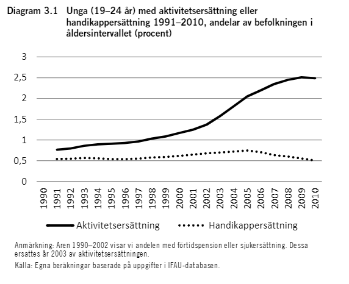

# Ung, snart vuxen

## Utbildning

Gymnasieskolan består av 12 yrkesprogram och sex högskoleförberedande program samt 5 introduktionsprogram. två av tre behöriga unga väljer högskoleförberedande program och en av tre yrkesförberedande. Läsåret 2019/20 gick XXXX elever något av dessa program.  
Introduktionsprogrammen erbjuder unga som inte var behöriga till gymnasieskolans nationella program en möjlighet att komma in på ett nationellt program alternativt komma in på arbetsmarknaden. Läsåret 2019/20 gick XXXX elever följde något av introduktionsprogrammen.

Valen till gymnasieskolan följer i stor utsträckning kön och social bakgrund. De dominerande bakgrundsfaktorerna är föräldrarnas samhällsklass, utbildningsnivå och ekonomiska situation.[^1]

[^1]: SOU 2020:46 s.337

----**Tabell över programmen och hur elever fördelar sig efter föräldrars utbildningsnivå in här?**----

En majoritet av eleverna är efter sina gymnasiestudier sysselsatta i förvärvsarbete eller i fortsatta studier. Av ungdomar som började på programinriktade val var xx procent sysselsatta xx år efter påbörjad gymnasieutbildning. Av de som påbörjade individuella program var XX procent sysselsatta, de flesta som arbetar arbetade inom vård och omsorg. 

Att inte ha en gymnasieexamen är till stor nackdel då man söker arbete. Andelen elever utan avgångsbetyg från gymnasiet fyra år eftyer påbörjad utbildning ligger sedan 2015 tämligen stabilt kring drygt 70 procent.

```{r echo=FALSE, message=FALSE, fig.align='center', fig.cap="andelen elever med gymnasieexamen 4 år efter påbörjad utbildning, kommuner per KF 2019. Källa: Kolada"}
library(readxl)  
library(tidyverse)
library(highcharter)
  
df_komkod <- read_excel("data/kommunblad/kommunkoder.xlsx")

df <- read_excel("data/kommunblad/gymexam.xlsx") %>% 
  filter(period == max(period) & gender != "T" ) %>% 
  left_join(df_komkod %>% select(komNr, komnamn, kf_namn), by = c("municipality" = "komNr"))

hc_male <- hchart(df %>% filter(gender == "M"), "point",
       hcaes(x = kf_namn, y = value, group = komnamn),
       width = 200) %>% 
  hc_legend({enable = FALSE}) %>% 
  hc_title(text = "Män") %>% 
  hc_tooltip(pointFormat = "<b>{point.y}</b><br/>",
             valueDecimals = 0,
             valueSuffix = " %")

hc_fem <- hchart(df %>% filter(gender == "K"), "point",
       hcaes(x = kf_namn, y = value, group = komnamn),
       width = 200) %>% 
  hc_legend({enable = FALSE}) %>% 
  hc_title(text = "Kvinnor")

hw_grid(hc_fem, hc_male)

```

Variationen mellan kommunerna är emellertid stor inom kommunalförbunden, både för män och för kvinnor. 


## Arbetsmarknaden

De flesta ungdomar gör en relativt problemfri resa in i arbetslivet. Men detta genomsnitt döljer en betydande variation. Ungdomar med funktionsnedsättning, unga med migrationsbakgrund och unga utan fullständiga gymnasiebetyg är tre grupper som har särskilt stora svårigheter att etablera sig på arbetsmarknaden. 

### Ungdomar med funktionsnedsättning

**Ett stycke om funktionsnedsättning och arbetsmarknad. Statistik från AF?.** De unga som har en funktionsnedsättning som medför nedsatt arbetsförmåga och är registrerade hos Arbetsförmedlingen, har aktivitetsersättning eller handikappersättning har som regel en svag position på arbetsmarknaden. 

Andelen unga med aktivitetsersättning eller handikappersättning har ökat över tid.

```{r fig_socsupport, echo=FALSE, out.width="70%%", fig.cap=""}

```

**Uppdatera denna bild mha Stativ-data.**


### Unga med migrationsbakgrund

Ungdomar med utländsk bakgrund har generellt en svaare arbetsmarknadsanknytning. Det gäller i synnerhet unga födda utomlands och som anlänt till Sverige under tonåren. Enligt en ESO-rapport har gruppens ställning på arbetsmarknaden inte försvagats över tid men gruppen har vuxit i storlek och utgör en större andel av unga som helhet jämfört med tidigare. [^2]

[^2]: Engdahl, M., Forslund, A. (2015): En förlorad generation? En ESO-rapport om ungas etablering på arbetsmarknaden. Rapport 2015:3, Expertgruppen för studier i offentlig ekonomi, Stockholm.

**Något om fördelningen av nyanlända elever i VG in här.**


### Unga utan fullständiga gymnasiebetyg

Denna grupp unga har i regel en betydligt senare inträde på arbetsmarknaden än övriga. I ovan nämnda rapport visar författarna att slutbetyg från gymnasiet har en effekt på inträdet på arbetsmarknaden oberoende av socioekonomisk bakgrund eller migrationsbakgrund. **Något om fördelningen etc i VG  in här. Kankse NEETS?**


