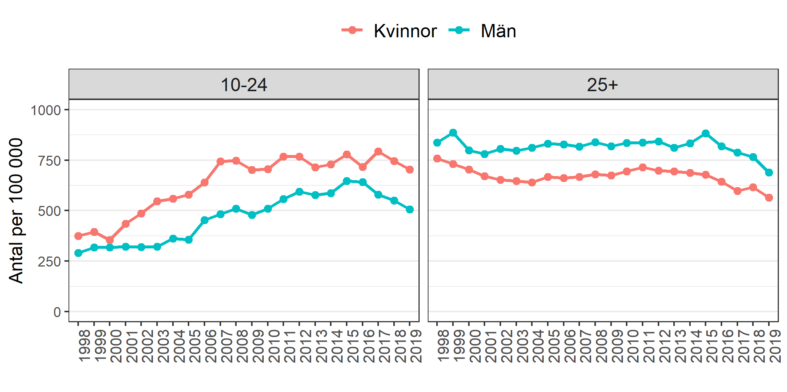

# Barns och ungas psykiska ohälsa  

Psykisk ohälsa hos barn och ungdomar har ökat i Sverige sedan 1980-talet och utvecklingen har varit större än i de övriga nordiska länderna. Folkhälsomyndigheten konstaterar att andelen 13- och 15-åringar i Sverige som rapporterar psykosomatiska besvär har fördubblats sedan mitten av 1980-talet (Folkhälsomyndigheten, 2018). Myndigheten pekar i sin rapport på brister i skolans funktion och en ökad medvetenhet bland ungdomarna om ökade krav på arbetsmarknaden, som troliga orsaker till ökningen av psykosomatiska symtom. Enligt Socialstyrelsens bedömning hade cirka 10 procent av pojkar och unga män år 2016 någon typ av psykisk ohälsa som föranlett kontakt med hälso- och sjukvård. För unga kvinnor var motsvarande siffra 15 procent. De diagnoser som främst ligger bakom ökningen är depressioner, olika ångestsyndrom och neuropsykiatriska funktionshinder (Socialstyrelsen, 2017). 

En viktig och relativt stor grupp utgörs av tidigt debuterande utvecklingsneurologiska problem, inte sällan överlappande varandra. Denna problematik har sammanfattats som ESSENCE-problematik  och beräknas omfatta ca 10 procent av alla skolbarn (Gillberg, 2010). 

Men det finns också en grupp elever vars ohälsa är mindre synlig och där förskolan riskerar att inte uppmärksamma deras behov av stöd. Det gäller t.ex. barn med vissa former av psykiatriska tillstånd och barn med lättare intellektuell funktionsnedsättning. Här bygger uppgifter om förekomst oftast på självrapporterade data i samband med olika enkätundersökningar. En stor grupp barn är sårbara och upplever psykosociala besvär t.ex. som en följd av stress i skolan, av mobbning eller utsatthet, eventuellt på grund av sviktande hemsituation. 

För många barn försämras hälsotillståndet under skolåren. Det gäller särskilt barn som lever under snävare livsvillkor, t.ex. till följd av fattigdom, trångboddhet eller föräldrars arbetslöshet. Här pekar forskningen på att en ökande individualisering generellt missgynnar dessa barn (G. Gillberg, 2010; Socialstyrelsen, 2009). I skolan har detta tagit sig uttryck i att eleverna har fått ta ett större ansvar för sin egen utbildning vilket sannolikt är positivt för de barn som kan få ett bra stöd från föräldrar eller andra vuxna runt barnet men missgynnar de barn som inte har adekvat stöd från vuxna runt barnet. 

Andelen 13- och 15-åringar, fr.a. flickor, med självrapporterade psykiska besvär ökar återigen efter en minskning under 2000-talet och varierar nu mellan 20–40 procent av unga. Denna utveckling menar Socialstyrelsen speglar en reell ökning av psykisk ohälsa och kan knappast förklaras med förändrade behandlingsrutiner eller ökad benägenhet bland unga att rapportera psykiska besvär (Socialstyrelsen, 2017).

En särskilt sårbar grupp är asylsökande barn, ensamkommande barn och i synnerhet papperslösa barn som ofta lever under oanständiga förhållanden.

## Psykiska besvär

Enligt den nationella undersökningen Hälsa på lika villkor rapporterar en ökande andel av unga (16–29 år) ett nedsatt välbefinnande sedan 2007 .  Andelen unga kvinnor som rapporterar nedsatt psykiskt välbefinnande har ökat från ca 20 procent 2007 till 33 procent 2018. Motsvarande andel för unga män var 10 procent respektive 19 procent. Det finns inga större skillnader mellan unga med olika utbildningsnivå. 

Däremot varierar andelarna mellan hälso- och sjukvårdsnämnderna, se Figur 1.

---**Figur på andelar pojkar/flickor med nedsatt psykiskt välbefinnande per HSN in här**---

Andelarna unga män med nedsatt välbefinnande varierar mellan 12 och 22 procent, med högst andel i HSN Göteborg och lägst i HSN Norra och HSN Östra. Motsvarande andelar för unga kvinnor var mellan 28 och 32 procent med högst andel i HSN Norra.

## Psykiatriska diagnoser

Under de senaste 20 åren har det i Västra Götaland skett en kraftig ökning av andelen unga individer som vårdats på grund av en psykiatrisk diagnos. För vuxna (25+ år) har trenden varit väsentligen stabil de senaste 20 åren, vanligare bland män än bland kvinnor (till vänster i Figur 3). Däremot ses en kraftigt ökande trend för både unga män och kvinnor (10–24 år) som vårdats för motsvarande diagnoser. 

```{r fig2, echo=FALSE, out.width="90%%", fig.cap="***Figur 2**  Antalet patienter i sluten vård pga psykiatrisk diagnos per 100 000 invånare i Västra Götaland 1998–2019. Män och kvinnor 10–24 år till vänster; Unga män och kvinnor 25+ år till höger. Källa: Socialstyrelsen. *"}

```


Ökningen betingas fr.a. av en ökning beträffande depressiva episoder, ångestsyndrom och neuropsykiatriska tillstånd. En inte oväsentlig del av ökningen betingas av vård av psykiska störningar på grund av att ha använt psykoaktiva substanser, t.ex. cannabis eller kombinationer av substanser, där andelen bland unga som vårdats i slutet av 1990-talet var omkring 3,5 procent medan motsvarande andel 2017 var närmare 7 procent. Andelen unga med andra allvarliga psykiatriska tillstånd, t.ex. schizofreni och andra psykotiska tillstånd, har varit tämligen oförändrad över åren fram till omkring 2010 då det bland pojkar sker en viss ökning av fr.a. ospecificerade psykoser, från ca 0,1 procent till drygt 0,3 procent 2017.

## Suicid och suicidförsök

Ett ytterligare uttryck för att psykisk ohälsa bland unga försämras är att självmorden bland unga inte minskar i samma takt som för vuxna. Resultaten från en nyligen genomförd trendanalys talade snarast för att antalet självmord bland unga ökar i gruppen 15–24 år. Det är en trend som verkar ha startat i mitten av 1990-talet och stiger sedan dess med ca 1 procentenhet årligen.   

Det har varit svårt att förklara denna trend. Mycket talar för att en rad faktorer samtidigt har betydelse. Sedan den ekonomiska krisen i början av 1990-talet har arbetsmarknaden för unga förändrats kraftigt parallellt med en förändrad näringslivsstruktur i riktning mot ett kunskapsintensivt tjänsteproducerande näringsliv. Det har lett till ökade krav på kompetens vilket inneburit att lågutbildade och utlandsfödda med lägre utbildning fått allt svårare att komma in på arbetsmarknaden. 

På ett övergripande plan spelar sannolikt en ökande individualiseringstrend en viktig roll (Gillberg, 2010; Socialstyrelsen, 2009). Den innebär bl.a. att människor prioriterar sina egna mål i livet framför till exempel sådana som bestäms utifrån religion, tradition eller nationens intressen samtidigt som individen får ökade möjligheter att genom aktiva val forma sitt eget liv. En konsekvens av individualiseringsprocessen är att individen får ta ett större ansvar för det egna livsprojektet och i mindre utsträckning kan förlita sig på tidigare kollektiva gemenskaper. De ökade valmöjligheterna kan då vara stimulerande och utvecklande för de som har ekonomiska eller kulturella resurser att välja medan det för dem som saknar sådana, kan valen istället bli en källa till frustration och oro över den egna livssituationen. 

De flesta självmord har en lång förhistoria. Processen kan pågå i flera år. Den långdragna processen gör att det är möjligt att finna åtgärder för att bryta den. Det är därför viktigt att främja psykisk hälsa och att arbeta för att tidigt upptäcka, förebygga och behandla psykisk ohälsa. För att sträva mot regeringens och regionfullmäktiges nollvision behövs en rad olika insatser. Det kan ske genom att höja förståelsen för, kunskapen om och kompetensen inom suicidprevention. Ett annat exempel är att bygga strukturer, och skapa förutsättningar, för ett långsiktigt och hållbart suicidpreventivt arbete. 
